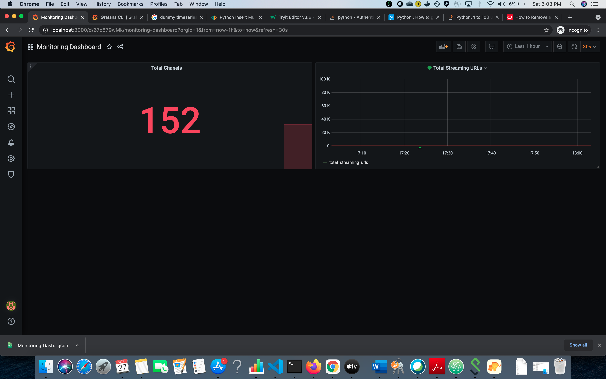

# Dev Ops – Senior Position: Assignment

It contains following files

## 1. monitoring_logs.sql
Generate pre-populated data using monitoring_logs.sql having schemas

## 2. create config.json as follows

```json

{
  "db_host" : "<host-name>",
  "db_name" : "monitoring_logs",
  "db_username" : "<db_username>",
  "db_password" : "<db-password>"
}

```
## 3. getData.py
* It will fetch data from URL and store it into MySQL database

## 4. runCron.py
* It will create cron job which will create cron job to run above script after every 10 minutes

## 5. Monitoring Dashboard.json
* assuming grafana dashboard is created use above json to import and create dashboard


